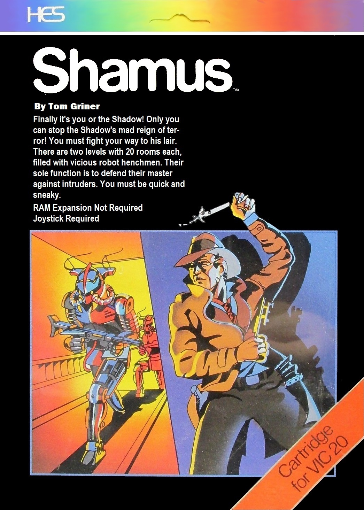

# Shamus for the Commodore Vic20
Shamus game disassembly with build scripts for reassembly.

Originally a cartridge with additional 8K memory at Block 5 (A000), it runs on VICE with this memory enabled and on an expanded Vic20, with memory allocated to block 5, usually via a switchable 35K RAM expansion.

Run `sh_build.bat` to build `Shamus.prg` and `sh_run.bat` to start the program in VICE.

Analysis documents:

- [Routine map](docs/routine-map.md)
- [Maze and progression](docs/maze-and-progression.md)
- [Entities and combat](docs/entities-and-combat.md)
- [Sound, timing, and PAL/NTSC behaviour](docs/sound-and-timing.md)
- [Startup and interrupts](docs/startup-and-interrupts.md)
- [Disassembly conventions](docs/disassembly-conventions.md)

